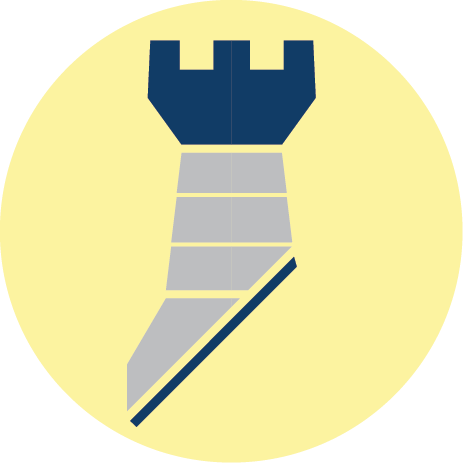

  

  <h1>Fortress</h1>
  
Structural Design Algorithms.

  
  

  
  
  
  
  
  
  
  

## Table of Contents

- [Why?](#why)
- [What?](#what)
- [Values](#values)
- [Open-Source](#open-source)
- [Contributing](#contributing)

## Why?

 
Engineers accept phenomenal responsibility when dedicating their lives to improve our built environment. Nevertheless, the vast majority of professional engineering software is closed source and proprietary. Engineers can rarely inspect, validate or influence the algorithms used to design our buildings and bridges. I believe this is unfair and must change. Fortress aspires to become the <em>single source of truth</em> for Structural Engineering Design algorithms. 

## What?

 
Fortress exposes structural engineering design algorithms and data services as RESTful Web API endpoints. This enables Technologists, Computational Designers and Software Developers working in AEC organisations to easily integrate structural design checks and calculations into their projects, regardless of their technology stack. 

 
Web APIs are typically built upon the language-agnostic HTTP/TLS network protocol. Whether you're developing desktop apps in C#, Machine Learning scripts in Python, or web apps in JavaScript, you can rely on these battle-tested structural design APIs to power your applications and supercharge your workflows. This way, you can focus on developing the bespoke features that matter to your teams and clients: those that drive competitive business value. 

## Values

Three core values underpin all software design decisions in this project:

1. Transparency, 
2. Robustness, 
3. Simplicity.

 
Re-inventing the wheel is costly and it risks introducing errors into calculations. Fortress abstracts you away from the underlying implementation details by exposing developer-friendly endpoints, whilst still allowing you the freedom to read, verify and validate the calculations for your own peace-of-mind.

## Open-Source

 
A transparent, verifiable API-as-a-Service offering designed specifically for Structural Engineers and BIM Professionals is certainly required in our industry. However, no single engineering consultancy is incentivised to build such a platform. Quite simply, this is the platform I wish had existed when I started out as a Software Engineer in AEC. 

 
For the AEC technology ecosystem to thrive, I believe that it falls upon <em>us</em> in the open-source community to innovate, collaborate and share our combined experiences to build the services that we deserve.

## Contributing

If you'd like to help build Fortress, please check out <a href="./CONTRIBUTING.md" target="_blank">CONTRIBUTING.md</a>.

